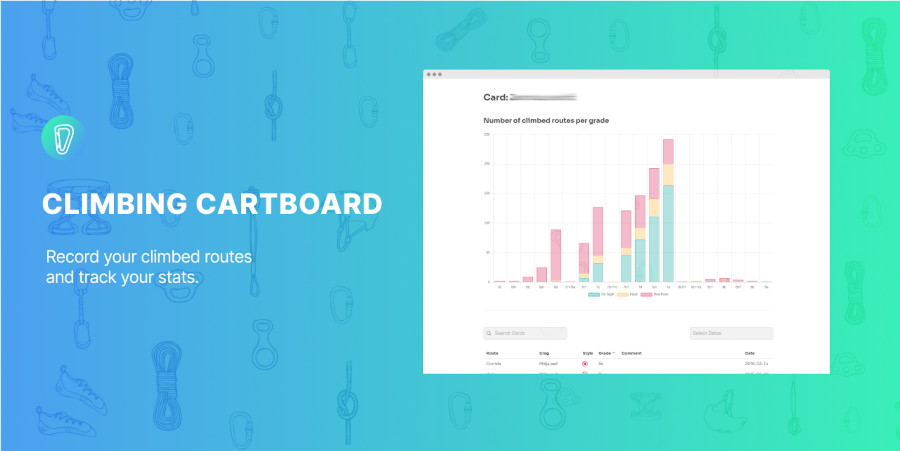

# Climbing Cartboard Wordpress Plugin

Wordpress plugin which let users to create climbing card/logbook, record climbed routes and track stats.




## Installation

https://wordpress.org/plugins/climbing-cartboard/

Note: Flush permalink (Settings > Permalinks) on fresh wordpress installation.

## Development

Bring up docker containers with `docker-compose up`

Install php packages with `composer install`

Build assets with `npm install && npm run dev`

Visit `localhost:8000`

Adminer available on `localhost:8080` (username: `wordpress`, password: `wordpress`)

## Wiki

https://github.com/rlabrovi/climbing-card/wiki

## Bug report

https://wordpress.org/support/plugin/climbing-cartboard/

https://github.com/rlabrovi/climbing-card

## Shortcodes
```
[last_climbed_routes number="10" show-route-in-header="0|1" show-date-in-header="0|1"]
[stats_counter]
[top_users_by_number_of_climbed_routes number="10"]
[stats]
```

## Todo
- [x] Remove users data from shortcodes if isClimbingCardPublic is false set for user
- [ ] Autocomplete Crags when inserting new route
- [ ] Tests 

## Release
1. Update changelog in `readme.txt`
2. Add release tag to git (e.g. `v1.0.9`)
3. Run `gulp release`. Enter new version `1.0.9`
4. On github add new [release](https://github.com/rlabrovi/climbing-card/releases)
5. Extract `/dist/climbing-card-v1.0.9` and copy content to `/svn/climbing-cardboard/trunk` and `/svn/climbing-cardboard/tags/1.0.9`
6. Push it to svn

## License

This plugin is released under the GNU General Public License Version 3 (GPLv3). For details, For details, see [license.txt](license.txt).
